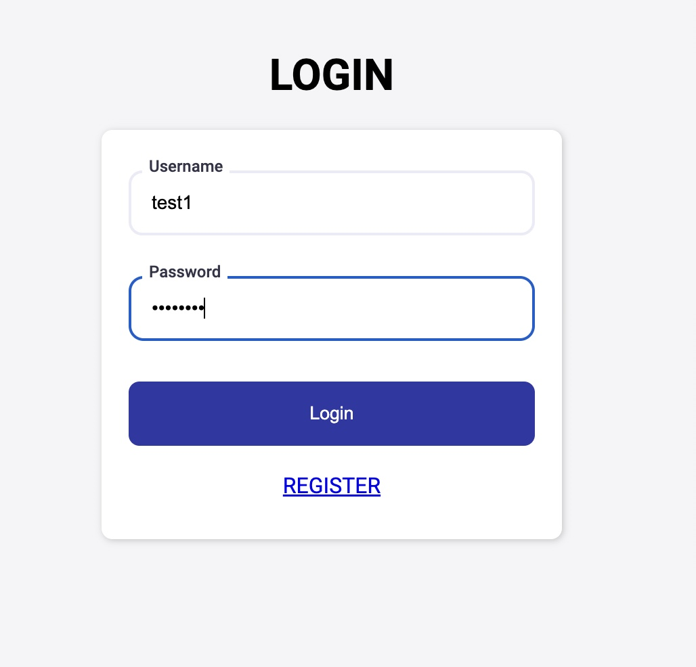
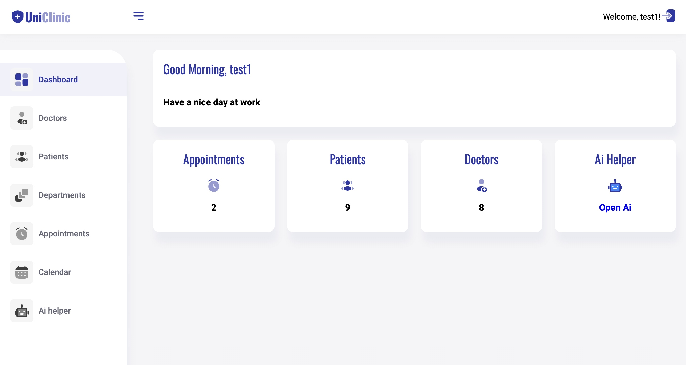
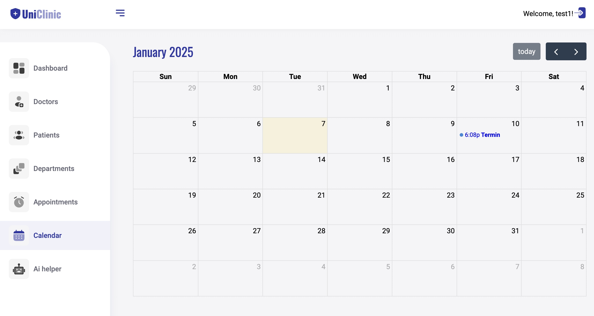
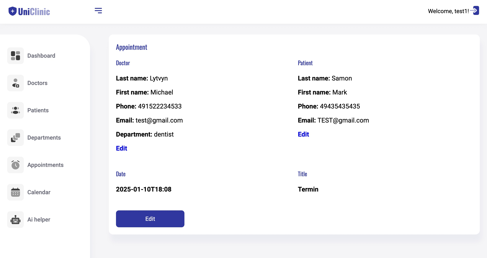
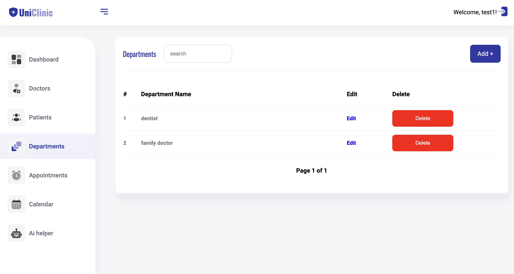
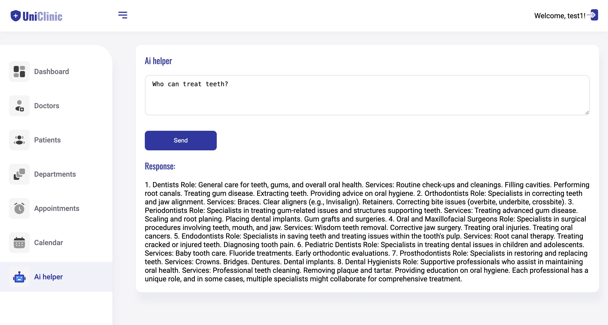
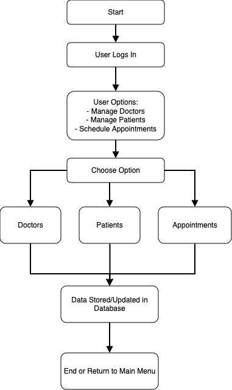

# Universal Clinic Management System

## Overview
The **Universal Clinic Management System** is a comprehensive solution designed to streamline healthcare facility operations. It automates the management of doctors, patients, and appointments, enhancing administrative efficiency and improving patient care.








---

## Purpose
This system:
- Simplifies the management of clinic operations.
- Reduces administrative workload.
- Provides a seamless experience for doctors, patients, and staff.

---

## Technology Stack
- **Spring Boot**: Framework for backend development with rapid setup and robust configurations.
- **Java**: Programming language for its reliability and object-oriented features.
- **MySQL**: Relational database system for secure and efficient data management.

---

## Key Features

### 1. User Management
- **Registration & Authentication**: Users can securely register and log in.
- **Profile Management**: Update personal details and manage passwords.

### 2. Doctor Management
- **Doctor Profiles**: Admins can manage doctor profiles, including specialty, contact info, and availability.
- **Schedule Management**: Doctors can view and manage their schedules.

### 3. Patient Management
- **Patient Registration**: Record patient details, including medical history.
- **Records Access**: Patients can access their medical records and appointment histories.

### 4. Appointment Scheduling
- **Booking Appointments**: Patients can book appointments with doctors.
- **Modify/Cancel Appointments**: Reschedule or cancel appointments as needed.

---

## System Entities

### User
- **Attributes**:
  - `name` (String)
  - `email` (String)
  - `password` (String)
- **Relationships**:
  - One-to-many with `Doctor`
  - One-to-many with `Patient`
  - One-to-many with `Appointment`
- **Methods**:
  - `addDoctor(Doctor doctor)`
  - `removeDoctor(Doctor doctor)`
  - `addPatient(Patient patient)`
  - `removePatient(Patient patient)`
  - `addAppointment(Appointment appointment)`
  - `removeAppointment(Appointment appointment)`

### Doctor
- **Attributes**:
  - `firstName` (String)
  - `lastName` (String)
  - `email` (String)
  - `phone` (String)
  - `department` (String)
- **Relationships**:
  - Many-to-one with `User`

### Patient
- **Attributes**:
  - `firstName` (String)
  - `lastName` (String)
  - `email` (String)
  - `phone` (String)
  - `birthday` (Date)
- **Relationships**:
  - Many-to-one with `User`

### Appointment
- **Attributes**:
  - `patientId` (Long)
  - `doctorId` (Long)
  - `appointmentDate` (Date)
- **Relationships**:
  - Many-to-one with `User`

---

## Benefits
- **Efficiency**: Reduces staff workload and minimizes errors.
- **Accessibility**: Centralized and secure access to information.
- **Scalability**: Handles growing user numbers and data needs.

---

## Key Processes

### User Registration and Login
- **Registration**: Users register with details like name, email, and password.
- **Login**: Authenticate with verified credentials.

### Doctor Management
- **Adding Doctors**: Admins can add doctor profiles.
- **Editing Details**: Update doctor contact info or specialties.
- **Removing Doctors**: Remove profiles of inactive doctors.

### Patient Management
- **Registering Patients**: Record patient details and medical history.
- **Updating Information**: Keep patient records up-to-date.
- **Removing Patients**: Delete inactive patient profiles.

### Appointment Scheduling
- **Booking Appointments**: Schedule appointments with a chosen doctor.
- **Viewing Appointments**: Access appointment details.
- **Modifying/Rescheduling**: Adjust appointment timings.
- **Canceling Appointments**: Remove unnecessary bookings.

### Data Access
- **User Profiles**: View and update personal information.
- **Doctor Schedules**: Check upcoming appointments.
- **Patient Histories**: Access medical records and appointment details.

---

## Diagrams

### Class Diagram
The class diagram represents the structure and relationships of entities in the system.


### Functional Diagram
The functional flowchart illustrates key processes in the system.



---

## Conclusion
The **Universal Clinic Management System** offers a robust and scalable solution for managing healthcare facilities. Built with modern technologies like Spring Boot and MySQL, it ensures reliability, security, and an enhanced user experience.

---

## Installation and Setup
1. Clone the repository:
   ```bash
   git clone https://github.com/your-repo/clinic-management-system.git
   ```
2. Navigate to the project directory:
   ```bash
   cd clinic-management-system
   ```
3. Build the project using Maven:
   ```bash
   mvn clean install
   ```
4. Run the application:
   ```bash
   java -jar target/clinic-management-system.jar
   ```
5. Access the application at `http://localhost:8080`.

---

## License
This project is licensed under the [MIT License](LICENSE).


